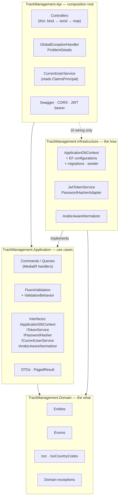
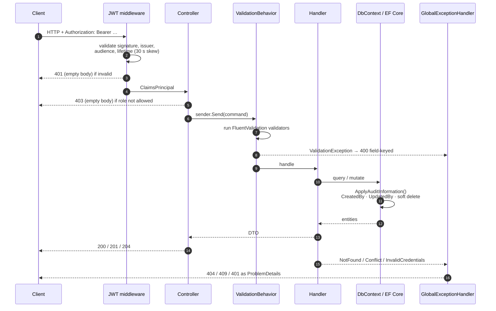
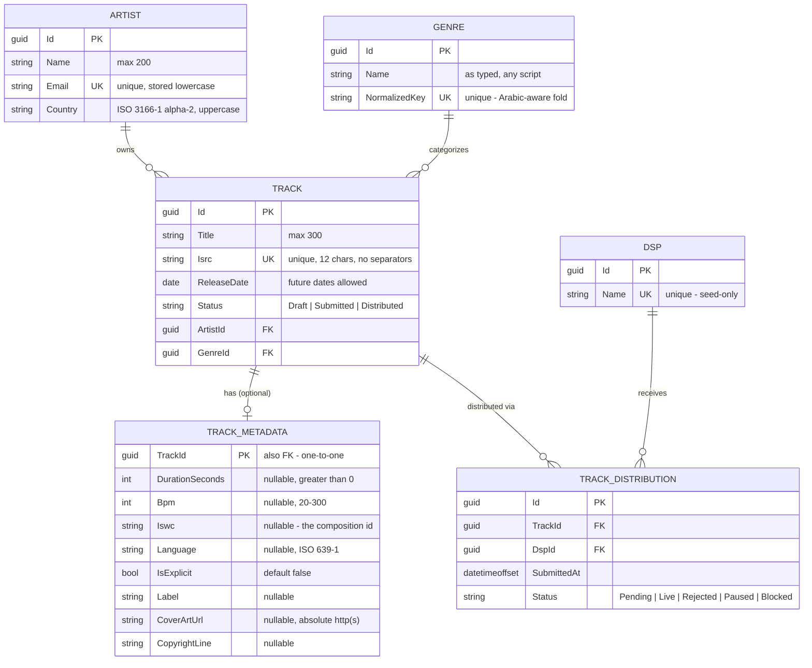
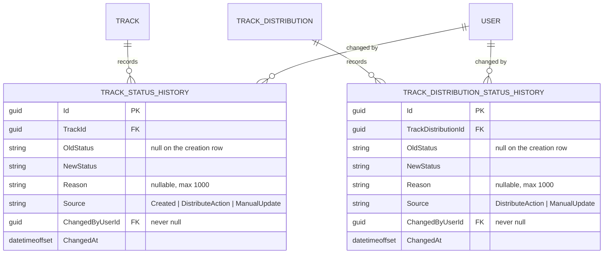
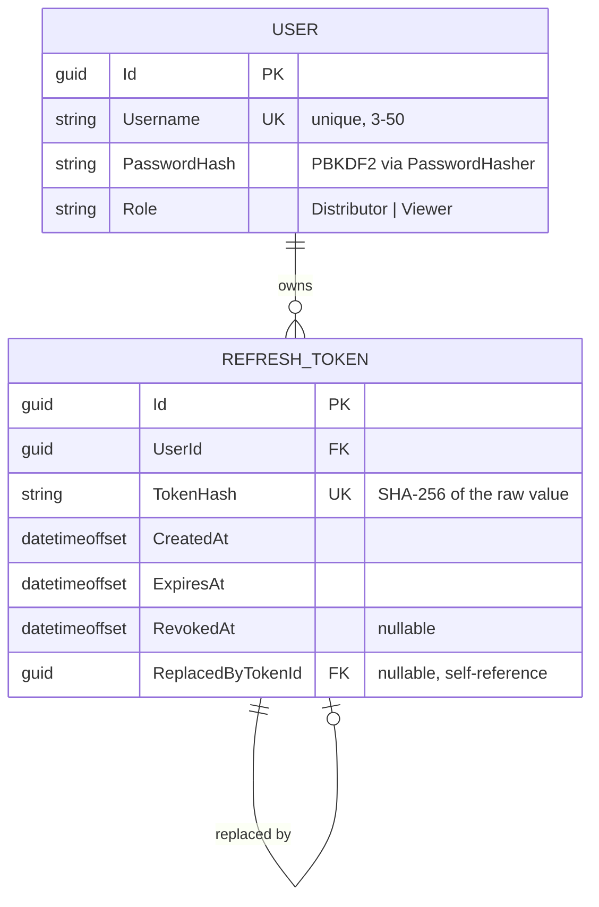
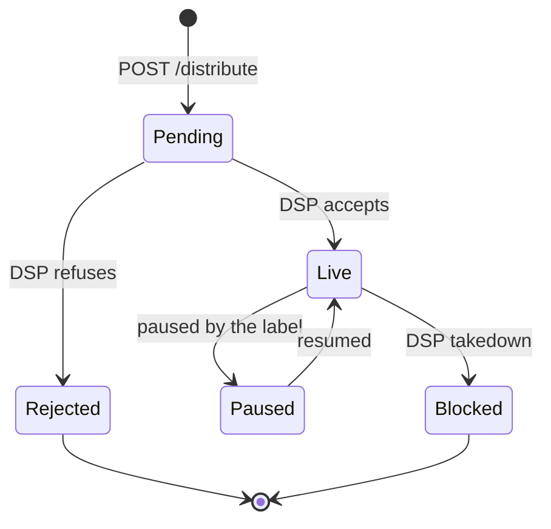
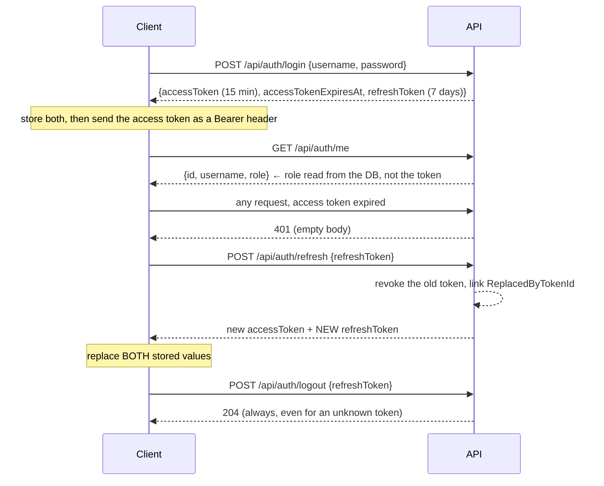

# Track Management Application

A track management system for a music distribution company: artists, their tracks, and the
status of those tracks across DSPs (Spotify, Apple Music, YouTube).

- **Backend** — .NET 10 Web API, Clean Architecture, CQRS with MediatR, EF Core + SQLite, JWT auth with refresh-token rotation.
- **Front-end** — Angular 21, standalone + zoneless, signal-based stores, no UI framework.

Built for the Takwene full-stack task. Task 1 (API) and Task 2 (two-view SPA) are both complete,
plus the additions listed in [What's implemented](#3-whats-implemented). The AI-usage write-up
required by Task 3 is in [DECISIONS.md](DECISIONS.md).

---

## Contents

1. [Prerequisites](#1-prerequisites)
2. [Quick start — run it in 4 steps](#2-quick-start--run-it-in-4-steps)
3. [What's implemented](#3-whats-implemented)
4. [Architecture](#4-architecture)
5. [Data model](#5-data-model)
6. [API reference](#6-api-reference)
7. [Backend implementation notes](#7-backend-implementation-notes)
8. [Front-end implementation notes](#8-front-end-implementation-notes)
9. [Tests](#9-tests)
10. [Configuration](#10-configuration)
11. [Troubleshooting](#11-troubleshooting)
12. [Repository layout](#12-repository-layout)

---

## 1. Prerequisites

| Tool | Version | Notes |
|---|---|---|
| [.NET SDK](https://dotnet.microsoft.com/download/dotnet/10.0) | **10.0** | Built and verified on `10.0.400`. Check with `dotnet --version`. |
| `dotnet-ef` CLI | **10.x** | Install once: `dotnet tool install --global dotnet-ef` (or `dotnet tool update --global dotnet-ef`). |
| [Node.js](https://nodejs.org) | **20.19+ / 22.12+ / 24+** | Built on `24.13.1`. Required by Angular 21. |
| npm | **10+** | Built on `11.8.0`. |

No database server is needed — persistence is **SQLite**, created as a file by the migration step.

---

## 2. Quick start — run it in 4 steps

Two terminals: one for the API, one for the client.

### Step 1 — create the database (run the migrations)

```bash
cd backend
dotnet ef database update --project src/TrackManagement.Infrastructure --startup-project src/TrackManagement.Api
```

This applies both migrations (`InitialCreate`, `AddArtistEmailUniqueIndex`) and creates
`backend/src/TrackManagement.Api/trackmanagement.db`.

> **Migrations are not applied automatically at startup** — that is deliberate (an app that
> silently migrates its own schema is a bad habit outside of demos), so this step is required
> before the first run. The database file is git-ignored, so it will not exist on a fresh clone.

### Step 2 — run the API

```bash
cd backend
dotnet run --project src/TrackManagement.Api
```

| | |
|---|---|
| API | <http://localhost:5229> |
| Swagger UI | <http://localhost:5229/swagger> |
| Health check | <http://localhost:5229/api/health> (anonymous) |

On the first run in `Development`, the API **seeds itself**: 2 users, 3 DSPs, 9 genres,
4 artists, 10 tracks, and their distributions and audit history. The seeder matches on natural
keys (email, name, ISRC), so restarting adds only what is missing — it never duplicates.

### Step 3 — run the client

```bash
cd client
npm install
npm start
```

Open <http://localhost:4200>. The API's CORS policy already allows that origin, so no proxy
configuration is needed.

### Step 4 — sign in

Two accounts are seeded so both roles are demonstrable:

| Username | Password | Role | Can do |
|---|---|---|---|
| `distributor` | `Distributor#123` | Distributor | Everything — create, edit, distribute, change statuses |
| `viewer` | `Viewer#123` | Viewer | Read-only; every write returns `403` and the UI hides the controls |

Sign in as `distributor` for the full experience, then sign out and in as `viewer` to see the
role gating.

### How to obtain a JWT token

**In the UI** — signing in does it for you; the token is held in memory by the client.

**With curl:**

```bash
curl -X POST http://localhost:5229/api/auth/login -H "Content-Type: application/json" -d "{\"username\":\"distributor\",\"password\":\"Distributor#123\"}"
```

```json
{
  "accessToken": "eyJhbGciOiJIUzI1NiIsInR5cCI6IkpXVCJ9...",
  "accessTokenExpiresAt": "2026-09-13T11:52:33.33+00:00",
  "refreshToken": "tCqgZ5lOYleMC/F9..."
}
```

Then send it on every request:

```bash
curl http://localhost:5229/api/tracks -H "Authorization: Bearer <accessToken>"
```

**In Swagger** — click **Authorize** (top right), paste just the `accessToken` value (no
`Bearer ` prefix — the scheme is already declared), and every subsequent "Try it out" is
authenticated.

> **Every endpoint requires a token**, including all `GET`s. The only anonymous routes are
> `POST /api/auth/login`, `POST /api/auth/refresh` and `GET /api/health`. This is a deliberate
> deviation from the task's implicit "reads are public" — a `Viewer` role only means something
> if reads require an identity. See [Auth and authorization](#auth-and-authorization).

### Useful extra commands

```bash
dotnet build                                  # from backend/ — build the whole solution
npm test                                      # from client/  — 56 unit tests (Vitest)
npm run build                                 # from client/  — production bundle into client/dist
```

Reset the database from scratch (deletes all data):

```bash
cd backend
dotnet ef database drop --force --project src/TrackManagement.Infrastructure --startup-project src/TrackManagement.Api
dotnet ef database update --project src/TrackManagement.Infrastructure --startup-project src/TrackManagement.Api
```

Create a new migration after changing an entity or configuration:

```bash
cd backend
dotnet ef migrations add <Name> --project src/TrackManagement.Infrastructure --startup-project src/TrackManagement.Api
```

`--project` is the assembly that owns the migrations (Infrastructure); `--startup-project` is
the app that supplies configuration (Api). Design-time construction of the `DbContext` goes
through `DesignTimeDbContextFactory`, which is why these commands need no running app and no
JWT key.

---

## 3. What's implemented

### Task 1 — Backend, required by the brief

| Requirement | Status | Where |
|---|---|---|
| `Artist`, `Track`, `DSP`, `TrackDistribution` entities | ✅ | `TrackManagement.Domain/Entities` |
| `POST /api/artists`, `GET /api/artists` | ✅ | `ArtistsController` |
| `POST /api/tracks` | ✅ | `TracksController` |
| `GET /api/tracks?artistId=&genre=&status=` | ✅ | `GetTracksQuery` |
| `GET /api/tracks/{id}` with DSP distribution statuses | ✅ | `GetTrackByIdQuery` |
| `POST /api/tracks/{id}/distribute` | ✅ | `DistributeTrackCommand` |
| `PATCH /api/tracks/{id}/status` | ✅ | `UpdateTrackStatusCommand` |
| EF Core with proper migrations | ✅ | 2 migrations, no `EnsureCreated` anywhere |
| Clean Architecture | ✅ | 4 projects, dependencies point inward |
| Input validation with meaningful errors | ✅ | FluentValidation + a MediatR pipeline behavior → field-keyed `400` |
| At least one JWT-protected endpoint | ✅ | **Every** endpoint bar login/refresh/health |
| Seed 3+ artists, 8+ tracks, 3 DSPs | ✅ | 4 artists, 10 tracks, 3 DSPs, 9 genres, 2 users |

### Task 2 — Front-end, required by the brief

| Requirement | Status |
|---|---|
| Track list with artist name, genre and status | ✅ `/tracks` |
| Filter by status | ✅ plus artist and free-text genre, all bound to the URL |
| Track detail with DSPs distributed to and their statuses | ✅ `/tracks/:id` |

### Beyond the brief

Added because the domain needs them, not for volume. Each one is justified where it appears
below.

**Backend**

- **Genre as an entity**, not a string column on `Track` — with **Arabic-aware duplicate
  detection** (`شعبى` and `شعبي` resolve to one row). See [Genre normalization](#genre-normalization).
- **Two independent status levels** — `Track.status` (our workflow) and `TrackDistribution.status`
  (what each DSP did), with `Paused` and `Blocked` added to the DSP scale so takedowns are
  representable.
- **A full audit trail** for both status levels — who, from what, to what, when, why, and
  whether the change was automatic or manual.
- **`TrackMetadata`** — duration, BPM, ISWC, language, explicit flag, label, cover art,
  copyright line. Optional, one-to-one with a track.
- **JWT auth with role-based authorization** — two roles, rotating refresh tokens, reuse
  detection, and hashed token storage.
- **Pagination** on every list endpoint, with a server-side cap.
- **Real validation of real identifiers** — ISRC format and prefix registry, ISO 3166-1
  country codes, not just "non-empty".
- **Soft delete plumbing** — `IsDeleted` + global query filters on every auditable entity
  (no delete endpoints are exposed; the infrastructure is there and enforced on reads).
- **Swagger with JWT support**, XML comments, and documented response codes.

**Front-end**

- Login, session restore across reloads, and **role gating** — a `Viewer` never sees a control
  that would `403`.
- **Single-flight, cross-tab-locked token refresh** — the API revokes every session for a user
  if a spent refresh token is replayed, so this is a correctness requirement, not a nicety.
- Full write flows: create/edit tracks and artists, distribute to DSPs, change both status
  levels with a reason, replace metadata, create genres.
- URL-bound filters and paging (back button, refresh and shared links all behave).
- A small hand-rolled UI kit, light/dark theming, skeletons, empty states, toasts, and a
  dialog built on native `<dialog>`.
- RTL-safe rendering of Arabic titles and genres (`<bdi>`, logical CSS properties).
- 56 unit tests over the parts where being wrong is expensive.

---

## 4. Architecture

### Clean Architecture layers



**The dependency rule:** `Domain` references nothing. `Application` references only `Domain`.
`Infrastructure` implements `Application`'s interfaces. `Api` references both `Application` and
`Infrastructure` — but only to register services in `Program.cs`; controllers depend on
`ISender` and Application DTOs, never on `Infrastructure` types.

The practical payoff: `Application` has no `Microsoft.EntityFrameworkCore.Sqlite` reference and
no knowledge of SQLite at all. It talks to `IApplicationDbContext`, which exposes `DbSet<T>` and
`SaveChangesAsync` — enough for real EF queries, but not enough to leak the provider.

### Request lifecycle



Controllers hold no logic. A typical action is one line: `Ok(await sender.Send(query, ct))`.
Everything interesting — validation, authorization decisions beyond the role attribute, business
rules, mapping — happens in the Application layer, which is what makes the handlers directly
testable without HTTP.

### CQRS shape

Every use case is a `record` command or query plus a nested `Handler` and `Validator`, colocated
in one file. There is no repository layer: EF Core's `DbSet` **is** the repository, and
`IApplicationDbContext` is the seam. Adding a repository on top of it would be a second
abstraction over the same thing.

Queries project straight to DTOs with `Select` (`TrackProjections.cs` holds the shared track
projection), so a list request selects only the columns it needs and materializes no entity
graph at all — a paged list is one `COUNT` plus one page query, with no lazy loading anywhere.

---

## 5. Data model

### Catalogue and distribution



`(TrackId, DspId)` on `TRACK_DISTRIBUTION` is a **unique index** — a track cannot be submitted to
the same DSP twice, and that index is also what `POST /distribute` uses to decide which requested
DSPs are new.

### Audit trail



Every status write in the system is the result of an authenticated API call, so
`ChangedByUserId` is never null. That is exactly what makes `Source` worth storing: it records
*why* the change happened — the row was just created, `POST /distribute` moved it, or someone
explicitly `PATCH`ed it — rather than *whether* a human was involved.

### Auth



The raw refresh token is returned to the caller **once** and never stored — only its SHA-256
hash is. A database dump therefore yields no usable session. `ReplacedByTokenId` chains a
rotation, which is what makes replay of a spent token detectable.

### Auditing on every business entity

Every catalogue entity inherits `AuditableEntity`:

| Column | Set by |
|---|---|
| `CreatedAt`, `CreatedByUserId` | `SaveChanges` interception, from `ICurrentUserService` |
| `UpdatedAt`, `UpdatedByUserId` | the same interception, on modify |
| `IsDeleted`, `DeletedAt`, `DeletedByUserId` | a `Remove()` is rewritten into a soft delete |

A global query filter (`HasQueryFilter(e => !e.IsDeleted)`) hides soft-deleted rows from every
query, including through navigation properties — the history tables filter on their parent's
`IsDeleted`, so orphaned audit rows can never surface.

### Indexes and constraints

| Table | Index | Kind |
|---|---|---|
| `Artists` | `Email` | unique (filtered to non-deleted rows) |
| `Genres` | `NormalizedKey` | unique |
| `Tracks` | `Isrc` | unique |
| `Dsps` | `Name` | unique |
| `Users` | `Username` | unique |
| `RefreshTokens` | `TokenHash` | unique |
| `TrackDistributions` | `(TrackId, DspId)` | unique |
| `TrackStatusHistories` | `(TrackId, ChangedAt)` | non-unique, for ordered reads |
| `TrackDistributionStatusHistories` | `(TrackDistributionId, ChangedAt)` | non-unique |

Delete behaviour: `Track → Metadata / Distributions / StatusHistory` cascades; everything that
would destroy an audit trail or a referenced lookup (`Artist → Track`, `Genre → Track`,
`Dsp → Distribution`, `User → History`) is `Restrict`.

Enums are persisted **as strings** (`HasConversion<string>()`), not ordinals — a reordered enum
cannot silently reinterpret existing rows, and the database stays readable.

### Enums

```
TrackStatus         Draft · Submitted · Distributed
DistributionStatus  Pending · Live · Rejected · Paused · Blocked
StatusChangeSource  Created · DistributeAction · ManualUpdate
Role                Distributor · Viewer
```

### The two status levels

This is the single most important modelling decision in the project.

| Concept | Field | Cardinality | Meaning |
|---|---|---|---|
| Where the **track** sits in our workflow | `track.status` | one per track | `Draft` → `Submitted` → `Distributed` |
| What **each DSP** did with it | `distribution.status` | one per track-DSP pair | `Pending` / `Live` / `Rejected` / `Paused` / `Blocked` |

A track can be `Distributed` while it is `Live` on Spotify, `Rejected` by Apple Music and
`Blocked` on YouTube. `track.status` means "we sent it", never "it is live everywhere". The UI
computes "is it actually live anywhere" from the distributions, and says so in words on the
detail page rather than letting the reader infer it from the track pill.

### Distribution lifecycle



This graph is **documented intent, not a server-enforced state machine** — the API validates
against the enum and accepts any transition, because a real operator sometimes has to correct a
wrong entry. The client offers only the transitions above in its dropdown
(`ALLOWED_DISTRIBUTION_TRANSITIONS`), so the sane path is the easy one without the API making
corrections impossible.

### Seeded data

| | Count | Detail |
|---|---|---|
| Users | 2 | `distributor` (Distributor), `viewer` (Viewer) |
| DSPs | 3 | Spotify, Apple Music, YouTube |
| Genres | 9 | Pop, Rock, Hip Hop, Electronic, Jazz, Classical, R&B, شعبي, طرب |
| Artists | 4 | EG, LB, GB, US |
| Tracks | 10 | 4 `Distributed`, 3 `Submitted`, 3 `Draft` |
| Distributions | 10 | covering **all five** DSP statuses |
| History rows | one per seeded status | so no audit trail is empty on first run |

The seed is chosen to exercise the interesting paths on day one: Arabic genres for the
normalizer, a `QM`-prefixed ISRC (a registrant allocation, not a country — the case a naive
ISO-only validator rejects), future release dates for scheduled releases, and at least one
distribution in every status.

---

## 6. API reference

Base URL `http://localhost:5229` · interactive docs at `/swagger`.

**`D`** = Distributor only · **`A`** = any authenticated user · **`—`** = anonymous.

| Method | Route | Role | Purpose |
|---|---|---|---|
| `POST` | `/api/auth/login` | — | Obtain an access + refresh token |
| `POST` | `/api/auth/refresh` | — | Rotate tokens |
| `POST` | `/api/auth/logout` | A | Revoke a refresh token → `204` |
| `GET` | `/api/auth/me` | A | Current user and role |
| `POST` | `/api/users` | D | Create an account (no self-registration) |
| `GET` | `/api/artists` | A | List, paged |
| `GET` | `/api/artists/{id}` | A | Detail |
| `POST` | `/api/artists` | D | Create → `201` |
| `PUT` | `/api/artists/{id}` | D | Update |
| `GET` | `/api/genres` | A | List, paged, alphabetical |
| `POST` | `/api/genres` | D | Create **or reuse** → `201` or `200` |
| `GET` | `/api/dsps` | A | All three DSPs (not paged) |
| `GET` | `/api/tracks` | A | List, paged, filtered |
| `GET` | `/api/tracks/{id}` | A | Full detail in one call |
| `POST` | `/api/tracks` | D | Create → `201`, always `Draft` |
| `PUT` | `/api/tracks/{id}` | D | Update title / genre / ISRC / release date |
| `PUT` | `/api/tracks/{id}/metadata` | D | **Replace** metadata |
| `POST` | `/api/tracks/{id}/distribute` | D | Submit to one or more DSPs |
| `PATCH` | `/api/tracks/{id}/status` | D | Override the track status |
| `PATCH` | `/api/tracks/{id}/distributions/{distributionId}/status` | D | Set one DSP's status |
| `GET` | `/api/health` | — | Liveness |

Everything the brief asked for is there; the extras are `auth/*`, `users`, `genres`, `dsps`,
the two `GET`-by-id and `PUT` routes, `metadata`, and the per-distribution status `PATCH`.
That last one is not optional in practice: the brief's `PATCH /tracks/{id}/status` only ever
touches the *track*, so without it nothing could move a distribution out of `Pending` and the
DSP statuses would be write-once.

### Auth and authorization



Rules that matter to any client:

1. **Refresh tokens rotate.** Every refresh returns a new one and revokes the old one immediately.
2. **Replaying a spent refresh token revokes every session for that user.** The server treats it
   as evidence the token leaked. This is why the Angular client serialises refreshes through a
   single in-flight promise *and* a cross-tab Web Lock.
3. **`/api/auth/me` reads the role from the database**, not from the token, so a role change takes
   effect on the next request rather than at the next token refresh.
4. **Login is deliberately indistinguishable** between an unknown username and a wrong password —
   the endpoint cannot be used to enumerate accounts.
5. **`401` and `403` have empty bodies.** Branch on the status code: `401` → refresh and retry;
   `403` → wrong role, refreshing would not help.

Role matrix:

| | Viewer | Distributor |
|---|---|---|
| Every `GET` | ✅ | ✅ |
| Create / edit artists, tracks, genres | ❌ `403` | ✅ |
| Distribute, change either status level | ❌ `403` | ✅ |
| Create user accounts | ❌ `403` | ✅ |

Authorization is fail-closed: a fallback policy requires an authenticated user on **every**
endpoint, and the three anonymous routes opt out explicitly with `[AllowAnonymous]`. A new
controller added tomorrow is protected by default rather than by remembering to protect it.

### Conventions

- `Content-Type: application/json` on every request with a body.
- **Enums cross the wire as strings** — `"Distributed"`, never `2`. Case-insensitive on input,
  PascalCase on output.
- `releaseDate` is date-only: `"2024-03-15"`. Timestamps are ISO-8601 with offset, in UTC.
- All ids are UUIDs.

**Pagination** — `?page=1&pageSize=20` (defaults). Out-of-range values are **clamped, not
rejected**: `pageSize=9999` returns 100, `page=0` returns page 1. Read `pageSize` back from the
response rather than assuming.

```json
{ "items": [ ... ], "page": 1, "pageSize": 20, "totalCount": 42, "totalPages": 3 }
```

**Error shapes** — four of them, each handled differently by the client:

| Status | Shape | Client behaviour |
|---|---|---|
| `400` | `{ title, status, errors: { "Field": ["message"] } }` | Map keys to form fields (they are PascalCase) |
| `401` / `403` | **empty body** | Branch on the code; do not try to parse |
| `404` / `409` | `{ title, status, detail }` | Toast or banner, not a field error |
| `500` | `{ title, status, detail: "An unexpected error occurred." }` | Generic message — never leaks internals |

Invalid enum values report the permitted set, which is worth surfacing verbatim:

```json
{ "errors": { "Status": ["'pendinggg' is not valid. Allowed values: Pending, Live, Rejected, Paused, Blocked."] } }
```

### Behaviours worth knowing before calling

**`GET /api/tracks`** — filters `artistId`, `status`, `genre`, all optional and combinable.
`genre` accepts **either a genre id or a genre name in any spelling**: `?genre=شعبى` finds
tracks tagged `شعبي`. Pass raw user text straight through; no need to resolve it to an id.

**`POST /api/genres`** returns **`201` when it created** a genre and **`200` when an equivalent
already existed** — the status code is the answer to "was this new?". Both are success. On a
`200` the body is the *existing* genre, which may be spelled differently from what was sent;
use the returned `id` and `name`.

**`POST /api/tracks`** — new tracks are always `Draft`; the status cannot be set on creation.

**ISRC** (`CC-XXX-YY-NNNNN`) — hyphens and spaces are accepted and stripped, input is uppercased,
and the result must be 12 characters: 2 letters, 3 alphanumerics, 7 digits. The 2-letter prefix
must be a real ISO country code **or** an ISRC registrant allocation (`QM`, `QN`, `QT`, `QZ`,
`ZZ`) — `QM` and `QZ` are extremely common on independent releases. Unique across the catalogue
(`409` otherwise).

**The ISRC's 2-digit year of reference is not range-checked**, on purpose. Two digits carry no
century — `76` is 1976 or 2076 — so anchoring them against "now" can only ever reject *old*
codes, and back-catalogue registrations legitimately carry pre-1986 values (the standard's own
example, `USRC17607839`, is 1976). The shape check is the honest limit of what two digits
support. The reasoning is written into `Isrc.cs` so it does not look like an oversight.

**`releaseDate` may be in the future** — scheduled releases are normal, so there is no upper
bound.

**`PUT /api/tracks/{id}`** does not accept an `artistId`. Moving a track between artists is a
catalogue transfer, not an edit, and giving it a dropdown on the edit form invites accidents.

**`PUT /api/tracks/{id}/metadata` is a replace, not a patch.** Any omitted field is cleared. The
form sends the complete object every time — the client has unit tests specifically for this.

**`POST /api/tracks/{id}/distribute`**

```jsonc
// request
{ "dspIds": ["21566112-…", "57c2f2f2-…"] }

// response
{
  "trackId": "4033c5ac-…",
  "trackStatus": "Distributed",
  "submitted":          [ { "dspId": "57c2f2f2-…", "dspName": "Apple Music", "status": "Pending" } ],
  "alreadyDistributed": [ { "dspId": "21566112-…", "dspName": "Spotify",     "status": "Live"    } ]
}
```

Re-sending a DSP the track already sits with is **not an error** — it comes back in
`alreadyDistributed` with its current status, so a caller can safely send the whole DSP list and
let the server work out what is new. An unknown DSP id fails the whole request with `404`. New
distributions start at `Pending`, and the track's own status moves to `Distributed`
automatically — no second call needed.

**Both status `PATCH`es return `changed: false`** when the submitted status equals the current
one. Nothing is written and no audit row is created. That is success, not an error — but the UI
should not claim it updated anything.

**CORS** is an allow-list, not a wildcard: `Cors:AllowedOrigins` in `appsettings.json`
(`http://localhost:4200` and `http://localhost:5173`). A new front-end origin has to be added
there or every request fails at the browser.

---

## 7. Backend implementation notes

### Validation

One FluentValidation validator per command, colocated in the same file as the command and its
handler. A MediatR `ValidationBehavior` runs them before the handler, so validation cannot be
skipped by forgetting an attribute, and a handler never has to defend against malformed input.

Failures surface as a single field-keyed `400`, with **all** failures at once rather than one at
a time. Shared rules live in `ValidationRules` so "a valid country" means the same thing
everywhere.

What is validated beyond presence and length:

| Field | Rule |
|---|---|
| `Artist.country` | membership of the embedded ISO 3166-1 alpha-2 list |
| `Track.isrc` | shape (12 chars after stripping separators), prefix registry, uniqueness |
| `Genre.name` | 2–100 chars; duplicates resolved by normalization, not a naive case compare |
| `TrackMetadata.*` | `durationSeconds > 0`, `bpm` 20–300, `language` two letters, `coverArtUrl` an absolute http(s) URL |
| `User.password` | minimum length at creation; never stored or logged in plaintext |
| `dspIds` | non-empty, no duplicates |
| Enums | a strict converter that names the allowed values in the error |

### Error handling

`GlobalExceptionHandler` (an `IExceptionHandler`, registered with `AddProblemDetails`) is the
single place an exception becomes a response:

| Exception | Response |
|---|---|
| `ValidationException` | `400` + `ValidationProblemDetails` with the field map |
| `InvalidCredentialsException` | `401` |
| `NotFoundException` | `404` + `detail` |
| `ConflictException` | `409` + `detail` |
| anything else | logged in full, returned as a bare `500` with a fixed message |

Nothing about an unexpected failure reaches the caller — no stack trace, no SQL, no type name.

### Security

- **Passwords** are hashed with ASP.NET Core's `PasswordHasher<T>` (PBKDF2, per-password salt,
  versioned format) behind an `IPasswordHasher` seam — the Application layer never sees the
  algorithm.
- **Refresh tokens** are 256 bits of cryptographically random data. Only a SHA-256 hash is
  stored; the raw value is shown once. Rotation on use, revocation chained through
  `ReplacedByTokenId`, and **reuse of a revoked token revokes every session for that user**.
- **The JWT signing key is not in the repository.** `appsettings.json` ships an empty
  `Jwt:SigningKey`, and `JwtOptions.Validate()` **fails startup** if the configured key is
  shorter than 32 bytes. The development key lives in `appsettings.Development.json` and is
  clearly labelled as such; a real deployment supplies it via user-secrets or the
  `Jwt__SigningKey` environment variable.
- **Token validation** checks issuer, audience, lifetime and signature, with 30 seconds of clock
  skew (the default 5 minutes is far too generous for a 15-minute token).
- **`MapInboundClaims = false`** — claims are read under the same short names they are written
  with. Without it, the handler silently rewrites `sub` and `role` to long URIs and role checks
  stop matching while still returning `200` on reads.
- **Authorization is fail-closed** via a fallback policy (see above).
- **CORS is an explicit origin allow-list**, never `AllowAnyOrigin`.
- **Login does not leak account existence**; logout does not leak token validity.
- **Enums are parsed strictly** — an unknown value is a `400` naming the valid set, not a
  silently-defaulted `0`.

### Genre normalization

The goal: `شعبي`, `شعبى`, `طَرب`, `جـاز`, `Pop`, `pop` and ` POP ` must not create near-duplicate
rows that fragment the catalogue.

```
NormalizeForDedup(input):
  1. trim, collapse internal whitespace
  2. Unicode NFKC
  3. strip Arabic diacritics (harakat) and tatweel (ـ)
  4. unify Arabic letter variants:  أ إ آ → ا   ى → ي   ؤ → و   ئ → ي
  5. lowercase (Latin)
  → stored as Genre.NormalizedKey, with a unique index
```

`ة` is deliberately **not** folded into `ه`: it would catch typos but also collapse genuinely
different words. That is a judgement call, and it is written down rather than left implicit.

The same fold is used in two places — creating a genre (dedup) and filtering tracks by genre name
— so a typo'd filter still finds the right tracks.

### Auditing and soft delete

`ApplicationDbContext.SaveChanges` intercepts the change tracker: `Added` entities get
`CreatedAt`/`CreatedByUserId`, `Modified` get `UpdatedAt`/`UpdatedByUserId`, and `Deleted` is
rewritten into `IsDeleted = true` plus `DeletedAt`/`DeletedByUserId`. The user id comes from
`ICurrentUserService`, which reads the `ClaimsPrincipal` — the Application layer asks "who is
this?" without knowing HTTP exists.

### Seeding

`DbSeeder` runs on startup **in Development only**, and a seeding failure is logged loudly but
never prevents the API from starting — sample data is a convenience, not a prerequisite. It
matches on natural keys, so it is safe to re-run, and it writes matching history rows for every
seeded status so the audit views have something real to show immediately.

---

## 8. Front-end implementation notes

**Angular 21**, standalone components, **zoneless** change detection, **signals** for all state,
typed reactive forms, and no UI framework — the styling is a small hand-written token system.
`zone.js` is not a dependency.

### Structure

```
client/src/app/
  core/                      cross-cutting, one instance per app
    auth/                    token-storage · auth.api · auth.store · auth.interceptor · auth.guard
    http/                    api-base-url · api-error (the error union) · error.interceptor
    notifications/           toast.store · toast-host
    theme/                   theme.store (light / dark / system)
  models/api.models.ts       every API shape, typed once
  shared/ui/                 button · card · field · dialog · pagination · skeleton
                             empty-state · status-pill · dsp-status · status-presentation
  layout/top-bar/            brand · nav · theme toggle · user chip with role badge · sign out
  features/
    auth/login/
    tracks/    data/{tracks.api, tracks.store, track-detail.store}
               ui/{track-filters, distributions-table, status-timeline,
                   distribute-dialog, status-change-dialog, metadata-form}
               pages/{track-list, track-detail, track-form}
    artists/   data/{artists.api, artists.store, countries}  pages/{artist-list, artist-form}
    genres/    data/genres.api  ui/genre-picker  pages/genre-list
    dsps/      data/dsps.api
    not-found/
```

The layering mirrors the backend: `api` files know HTTP and nothing else, `store` files hold
state and know nothing about templates, `pages` and `ui` render and know nothing about
transport.

### Routes

Every route is lazy-loaded, so a page costs only what it renders.

| Route | Guard | View |
|---|---|---|
| `/login` | `anonymousGuard` | Sign in |
| `/tracks` | `authGuard` | **Track list** (Task 2, view 1) |
| `/tracks/new` | `authGuard` + `distributorGuard` | Create a track |
| `/tracks/:id` | `authGuard` | **Track detail** (Task 2, view 2) |
| `/tracks/:id/edit` | `authGuard` + `distributorGuard` | Edit a track |
| `/artists` | `authGuard` | Artist list |
| `/artists/new`, `/artists/:id/edit` | `authGuard` + `distributorGuard` | Artist form |
| `/genres` | `authGuard` | Genre list and creation |
| `**` | — | Not found |

`/tracks/new` is declared before `/tracks/:id`, or "new" would be matched as an id.

### Session handling — the part that had to be right

The API revokes **every** session for a user when a spent refresh token is presented again. Two
tabs each firing their own refresh is therefore not a performance problem, it is a logout. Four
defences, in `auth.store.ts`:

1. **Single-flight** — one shared promise, so simultaneous `401`s await one refresh.
2. **A cross-tab Web Lock** — refreshes are serialised across tabs, and the stored token is
   re-read *inside* the lock so a waiter never spends a value the tab ahead of it already burned.
3. **Proactive refresh** — renewal is scheduled a minute before expiry, so the `401` race usually
   never starts.
4. **A `BroadcastChannel`** — a tab that refreshes hands the new access token to its siblings, so
   they do not refresh at all.

**Token storage:** the access token lives **in memory only** and is never written anywhere; only
the refresh token is persisted (`localStorage`), because it has to survive a reload and the API
returns it in a response body rather than an httpOnly cookie. So a successful XSS cannot lift a
live bearer token out of storage — it would have to wait for, and win, a refresh. The residual
trade-off is deliberate and known: the clean fix is a BFF that keeps the refresh token in an
httpOnly cookie, which is out of scope for this task.

`provideAppInitializer` exchanges the stored refresh token for a session **before the first route
renders**, so guards never see a half-restored state and no login screen flashes on reload.

**Interceptor rules** (`auth.interceptor.ts`), each one guarding a refresh token:

- Login and refresh carry no bearer and are never retried — retrying a failed refresh is how one
  expired session becomes "signed out of everything".
- Logout gets a bearer but no retry; a `401` there means the session is already gone.
- A `403` is a role failure, not an expiry — refreshing would spend a good token to earn the
  same `403`.

### Errors

`parseApiError` turns every failure into one union — `validation | unauthenticated | forbidden |
message | server | offline` — captured from the running API rather than transcribed from a
document. Status `0` becomes `offline` (API down, DNS, or CORS — indistinguishable from the
browser, and all three mean "we never reached the API").

Field errors are mapped back onto form controls by name; everything else becomes a toast. The
error interceptor observes and rethrows — it never swallows.

### Screens

**Track list** (`/tracks`) — title, artist, genre, ISRC, release date and status pill, sorted by
title. Filters for **status**, **artist** and **genre** (free text, debounced, any spelling)
plus paging, all bound to the **URL**: the back button, a refresh and a shared link all behave,
and the store holds no filter state at all. Out-of-order responses are discarded by sequence
number, so a slow earlier request cannot overwrite a fresher one. Loading shows skeleton rows,
and stale rows dim rather than disappearing during a refetch.

**Track detail** (`/tracks/:id`) — one `GET /api/tracks/{id}` feeds the entire page:

- Header with title, artist, genre, ISRC, release date, the track status pill and a **Change**
  action.
- A plain-language line for **"is this actually live anywhere"**, computed from the
  distributions, so the two status levels are never conflated.
- **Distribution table** — DSP name, submitted date, status, an expandable per-DSP audit
  timeline, and a per-row **Update** action.
- **Metadata** panel, with an edit dialog that always sends the complete object (the API's
  metadata `PUT` is a replace).
- **Track history** — the full audit trail, rendered source-aware: "set automatically when the
  track was distributed" reads differently from "changed by sara".

**Write flows** — create/edit track, create/edit artist (with a 249-entry ISO country picker
built from `Intl.DisplayNames`), distribute to a checkbox list of DSPs, change either status
level with an optional reason, replace metadata, and create genres from a picker that handles
the API's **two success codes** (`201` created / `200` reused) and tells the user when their
spelling was folded into an existing genre.

**Everything writeable is role-gated** by `auth.canWrite()`, so a Viewer is never shown a button
that would `403` — and the top bar shows the role badge, so it is obvious *why* fewer controls
are present.

### Details that are easy to get wrong and were not

- **RTL-safe rendering** — Arabic titles and genre names are wrapped in `<bdi>` so a mixed-script
  table cell cannot reorder itself; layout uses logical properties.
- **Accessibility** — the clickable table row still carries a real link for the accessible name
  and keyboard focus (a `<tr>` can have neither), dialogs are native `<dialog>`, tables have
  captions, the theme toggle has a state-aware `aria-label`, and there is a skip link.
- **`withViewTransitions()` is deliberately absent** — it makes every navigation await
  `document.startViewTransition()`, which never settles while the page is not being painted, and
  that silently broke the post-logout redirect. A cosmetic crossfade is not worth making
  navigation depend on the compositor.
- **Theme** is applied by a pre-paint script in `index.html`, so there is no flash of the wrong
  theme on load; the preference is `light`, `dark` or `system`.

---

## 9. Tests

**Client — 56 unit tests** (Vitest, via `@angular/build:unit-test`):

```bash
cd client
npm test
```

| Suite | Tests | What it protects |
|---|---|---|
| `api-error.spec.ts` | 13 | Every error shape, from bodies captured off the running API |
| `auth.store.spec.ts` | 8 | Single-flight refresh, session restore, sign-out |
| `auth.interceptor.spec.ts` | 6 | Bearer attachment, 401-refresh-retry-once, the no-retry rules |
| `status-presentation.spec.ts` | 10 | The two status scales and the allowed transition table |
| `pagination.spec.ts` | 5 | Page-window arithmetic |
| `metadata-form.spec.ts` | 4 | The "replace, not patch" rule |
| `genres.api.spec.ts` | 4 | The 200-vs-201 distinction |
| `genre-list.spec.ts` | 4 | Reuse feedback on the list page |
| `app.spec.ts` | 2 | Bootstrap |

The tests sit where being wrong is expensive — token refresh, error mapping, the metadata
replace rule, the genre dual success code — rather than spread thinly for a coverage number.

**Backend** — no automated test project. The API was verified by exercising every endpoint
against the running service (the request/response examples in this README are captured from it,
not written from the source). That is the honest state of it: with more time, the first tests
would be handler-level tests over an in-memory `IApplicationDbContext` for `DistributeTrack`,
`CreateGenre` normalization, and the refresh-token rotation path — the three places where the
logic is non-obvious enough to regress silently.

---

## 10. Configuration

### Backend

`backend/src/TrackManagement.Api/appsettings.json`:

| Key | Default | Notes |
|---|---|---|
| `ConnectionStrings:DefaultConnection` | `Data Source=trackmanagement.db` | SQLite, relative to the API project directory |
| `Cors:AllowedOrigins` | `http://localhost:4200`, `http://localhost:5173` | Explicit allow-list. Add your origin or the browser blocks every call |
| `Jwt:Issuer` | `TrackManagement.Api` | |
| `Jwt:Audience` | `TrackManagement.Client` | |
| `Jwt:SigningKey` | **empty** | Must be ≥ 32 bytes or startup fails. Dev value lives in `appsettings.Development.json` |
| `Jwt:AccessTokenMinutes` | `15` | |
| `Jwt:RefreshTokenDays` | `7` | |

For anything other than local development, supply the key out of band:

```bash
cd backend/src/TrackManagement.Api
dotnet user-secrets init
dotnet user-secrets set "Jwt:SigningKey" "<at least 32 bytes of random text>"
```

or set the `Jwt__SigningKey` environment variable. The app refuses to start with a short or
missing key rather than falling back to a default — a hard failure at startup beats a signed
token anyone can forge.

### Front-end

`client/src/environments/environment.development.ts` and `environment.ts` both set
`apiBaseUrl: 'http://localhost:5229'`. Point them elsewhere to target another API; the
production file is a placeholder because this task has no deployment target.

---

## 11. Troubleshooting

| Symptom | Cause and fix |
|---|---|
| `SQLite Error 1: 'no such table: Tracks'` | Migrations were not run. See [Step 1](#step-1--create-the-database-run-the-migrations). |
| API exits at startup with a `Jwt:SigningKey` error | Running outside `Development` without a key configured. Set it via user-secrets or `Jwt__SigningKey`. |
| `dotnet ef` is not a recognised command | `dotnet tool install --global dotnet-ef`, then reopen the terminal. |
| Every client request fails with a CORS error, or the network tab shows status `0` | The API is not running, or the client origin is not in `Cors:AllowedOrigins`. |
| The client loads but every call is `401` | The API restarted with a different signing key; sign out and back in. |
| `MSB3027: the file is locked by TrackManagement.Api` when building | The API is still running. Stop it, then build. |
| The UI shows no create/edit buttons | You are signed in as `viewer`. That is the role gating working — sign in as `distributor`. |
| Empty catalogue on first run | Seeding only runs in `Development`, and only after the migrations have created the schema. |
| Arabic text looks garbled when testing from a terminal | Send genuinely UTF-8 encoded JSON — write the body to a file and use `--data @file` rather than passing it as a shell argument. |

---

## 12. Repository layout

```
Track_Management_Application/
├── README.md                  this file
├── DECISIONS.md               Task 3 — the AI-usage write-up
├── backend/
│   ├── TrackManagement.sln
│   └── src/
│       ├── TrackManagement.Domain/          entities · enums · ISRC and ISO codes · exceptions
│       ├── TrackManagement.Application/     commands · queries · validators · DTOs · interfaces
│       ├── TrackManagement.Infrastructure/  DbContext · configurations · migrations · seed
│       │                                    JWT · password hashing · Arabic normalizer
│       └── TrackManagement.Api/             controllers · exception handler · Swagger · DI
└── client/
    ├── README.md              client-specific run notes
    └── src/app/               core · shared · layout · features · models
```

### Commit history

One commit per implementation phase, in dependency order — backend: skeleton → domain →
application plumbing → persistence → API composition → auth → genres → artists → tracks →
metadata → distribution → seeding → docs; then the client: scaffold → models and errors → auth
→ UI kit → track list → track detail → write flows → artists and genres. Nothing is squashed,
and the message on each commit says what that phase added.

---

## Task 3

The AI-usage questions — what was generated versus written, what security issues turned up in
generated code, and what the AI got wrong — are answered in **[DECISIONS.md](DECISIONS.md)**.
